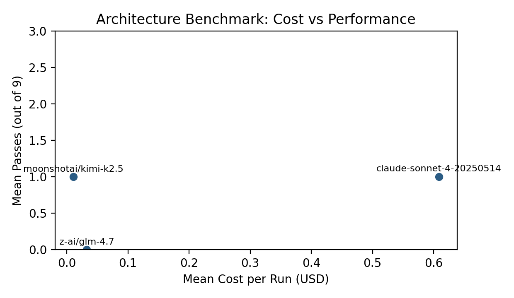
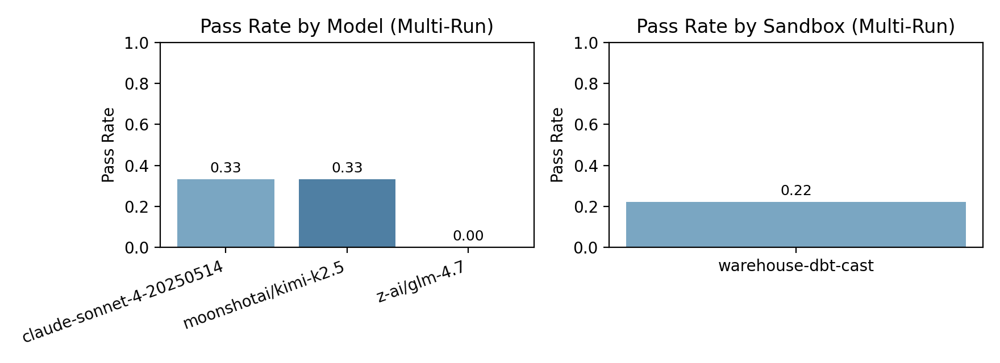

# Warehouse DBT Cast Sandbox Experiment — February 9, 2026

## Objective

Test whether normalizing timestamps in staging (specifically `stg_app_api_usage.usage_created_at`) removes the DuckDB `-(VARCHAR, INTERVAL)` failure mode and yields more signal on logic errors rather than type errors.

## New Sandbox Variant

`warehouse-dbt-cast`
- Based on `warehouse-dbt`
- Only change: `stg_app_api_usage` casts `created_at` to `TIMESTAMP`:
  - `CAST(created_at AS TIMESTAMP) AS usage_created_at`

This reflects a common dbt pattern: type normalization in staging so downstream marts don’t need to guess types.

## Method

Models
- `claude-sonnet-4-20250514`
- `moonshotai/kimi-k2.5`
- `z-ai/glm-4.7`

Runs
- 1 run per model
- `--sandbox=warehouse-dbt-cast`
- Anthropic: `max-turns=10`
- OpenRouter: `max-turns=8`
- Lint disabled (`--no-lint`)

## Results Summary

Passes per run (out of 3 tasks):
- `claude-sonnet-4-20250514`: 1/3
- `moonshotai/kimi-k2.5`: 1/3
- `z-ai/glm-4.7`: 0/3

Primary failure modes:
- Sonnet: `active_user_arpu` + `org_churn_rate` hit max-turns; `avg_org_ltv` passed
- Kimi: `active_user_arpu` + `org_churn_rate` hit max-turns; `avg_org_ltv` passed
- GLM: `active_user_arpu` and `avg_org_ltv` wrong values; `org_churn_rate` max-turns

## Charts





## Observations

- The staging cast **removes the timestamp arithmetic error**, but does not guarantee correct logic.
- In this run, the dominant failures were **turn limits** (Sonnet/Kimi) and **wrong-value logic** (GLM).
- This suggests the error floor moved from type errors to reasoning/iteration limits, which is a more useful signal for evaluating architecture quality.

## Reproduction

Anthropic example:
```bash
node --experimental-strip-types scripts/architecture-benchmark.ts \
  --sandbox=warehouse-dbt-cast \
  --model=claude-sonnet-4-20250514 \
  --max-turns=10 \
  --no-lint \
  --output=artifacts/reports/warehouse_dbt_cast_runs_2026-02-09/claude-sonnet-4-20250514-run1.json
```

OpenRouter example:
```bash
OPENROUTER_API_KEY=... node --experimental-strip-types scripts/architecture-benchmark.ts \
  --sandbox=warehouse-dbt-cast \
  --model=moonshotai/kimi-k2.5 \
  --max-turns=8 \
  --no-lint \
  --output=artifacts/reports/warehouse_dbt_cast_runs_2026-02-09/moonshotai-kimi-k2.5-run1.json
```
