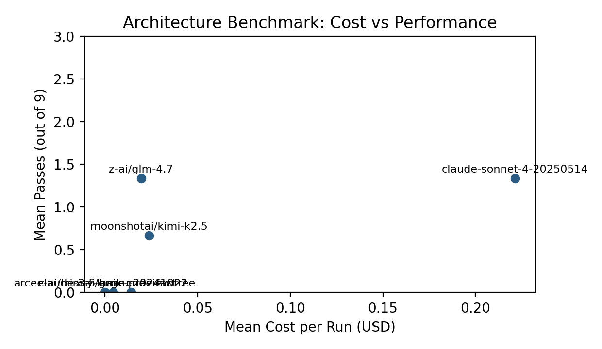
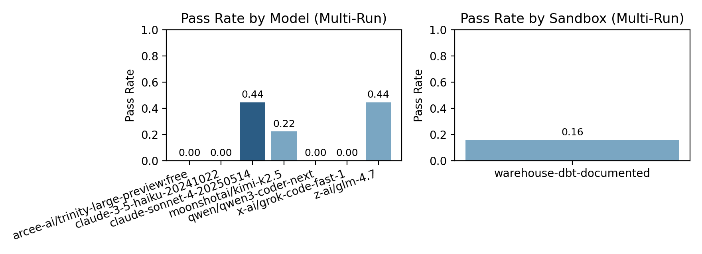

# Warehouse DBT Documented Sandbox Experiment — February 9, 2026

## Objective

Test whether providing **explicit column and join documentation** (schema.yml) in a warehouse+DBT sandbox narrows the performance gap compared to the baseline warehouse‑dbt sandbox.

This isolates the effect of `schema.yml` and documented dependencies, approximating how `ref()` + model documentation provide information density in real dbt projects.

## Hypotheses

Three possible outcomes:
1. **Gap narrows significantly** → the issue was information density, not architecture.
2. **Gap narrows slightly** → documentation helps but architecture still matters.
3. **Gap doesn’t move** → structural issues (split context, SQL indirection, casting) dominate.

## New Sandbox Variant

`warehouse-dbt-documented`
- Identical to `warehouse-dbt` in data, tasks, and validation.
- Adds a comprehensive `models/schema.yml` with column names and join hints.
- System prompt explicitly directs the model to read `models/schema.yml`.

### Documented Join Hints (examples)
- `stg_app_users.stripe_customer_id` ↔ `stg_stripe_invoices.customer_id`
- `stg_app_users.organization_id` ↔ `stg_app_organizations.organization_id`
- Invoice revenue uses `amount_paid` with `status = 'paid'`

## Method

Models (Opus excluded per request)
- `claude-3-5-haiku-20241022` (Anthropic)
- `claude-sonnet-4-20250514` (Anthropic)
- `moonshotai/kimi-k2.5` (OpenRouter)
- `z-ai/glm-4.7` (OpenRouter)
- `x-ai/grok-code-fast-1` (OpenRouter)
- `arcee-ai/trinity-large-preview:free` (OpenRouter)
- `qwen/qwen3-coder-next` (OpenRouter)

Runs
- 2 runs per model (plus 1 extra run after adding a timestamp-casting hint in schema.yml for Sonnet/Kimi/GLM)
- `--sandbox=warehouse-dbt-documented`
- Anthropic: `max-turns=10`
- OpenRouter: `max-turns=8`
- Lint disabled (`--no-lint`)

## Results Summary

Mean passes per run (out of 3 tasks) by model:

Model | Mean Passes | Run Totals
claude-3-5-haiku-20241022 | 0.0 | 0, 0
claude-sonnet-4-20250514 | 1.33 | 1, 1, 2
moonshotai/kimi-k2.5 | 0.67 | 0, 1, 1
z-ai/glm-4.7 | 1.33 | 1, 1, 2
x-ai/grok-code-fast-1 | 0.0 | 0, 0
arcee-ai/trinity-large-preview:free | 0.0 | 0, 0
qwen/qwen3-coder-next | 0.0 | 0, 0

Cost per run (mean, where pricing is known):
- claude-3-5-haiku-20241022: $0.0045
- claude-sonnet-4-20250514: $0.1858
- moonshotai/kimi-k2.5: $0.0176
- z-ai/glm-4.7: $0.0171
- x-ai/grok-code-fast-1: $0.0142
- arcee-ai/trinity-large-preview:free: $0.0000
- qwen/qwen3-coder-next: n/a (pricing not provided)

Average token usage per run (approx.):
- claude-3-5-haiku-20241022: 33,872 in / 7,122 out
- claude-sonnet-4-20250514: 36,093 in / 7,535 out
- moonshotai/kimi-k2.5: 28,270 in / 4,931 out
- z-ai/glm-4.7: 17,924 in / 8,255 out
- x-ai/grok-code-fast-1: 19,885 in / 6,827 out
- arcee-ai/trinity-large-preview:free: 13,546 in / 290 out
- qwen/qwen3-coder-next: 15,821 in / 766 out

## Charts





## Observations

- Documentation **did not eliminate** the dominant failure mode: time-window logic in DuckDB.
  - Many failures were the familiar `-(VARCHAR, INTERVAL)` error, indicating timestamp casting issues rather than missing columns.
- Models that succeeded did so mostly on **avg_org_ltv**; `active_user_arpu` and `org_churn_rate` were consistently harder.
- The documented schema was **frequently read**, but the wins did not meaningfully improve relative to baseline warehouse‑dbt runs.

After adding an explicit cast hint to `usage_created_at` in schema.yml, Sonnet/GLM improved on `org_churn_rate` (and GLM matched Sonnet’s 2/3 in one run), but **`active_user_arpu` still failed** due to logic/aggregation errors rather than missing columns.

Preliminary read: this leans toward **Outcome 3 (gap doesn’t move)**, driven by structural SQL issues rather than missing column names. More runs would be needed for confidence.

## Active User ARPU SQL (Before vs After Cast Hint)

Source: Sonnet runs in `warehouse-dbt-documented`, `active_user_arpu` task.

Before (run1, runtime error `-(VARCHAR, INTERVAL)`):
```sql
WITH latest_api_usage AS (
    SELECT MAX(usage_created_at) AS max_created_at
    FROM stg_app_api_usage
),

active_users AS (
    SELECT DISTINCT user_id
    FROM stg_app_api_usage
    CROSS JOIN latest_api_usage
    WHERE usage_created_at >= (max_created_at - INTERVAL '30 days')
),

active_user_revenue AS (
    SELECT 
        au.user_id,
        COALESCE(SUM(si.amount_paid), 0) AS total_paid
    FROM active_users au
    LEFT JOIN stg_app_users u ON au.user_id = u.user_id
    LEFT JOIN stg_stripe_invoices si ON u.stripe_customer_id = si.customer_id
        AND si.status = 'paid'
    GROUP BY au.user_id
),

arpu_calculation AS (
    SELECT 
        COUNT(*) AS active_user_count,
        SUM(total_paid) AS total_revenue,
        CASE 
            WHEN COUNT(*) > 0 THEN ROUND(SUM(total_paid) / COUNT(*))
            ELSE 0
        END AS arpu
    FROM active_user_revenue
)

SELECT arpu AS metric_value
FROM arpu_calculation
```

After (run3, runtime OK but wrong value):
```sql
WITH latest_api_usage AS (
    SELECT MAX(CAST(usage_created_at AS TIMESTAMP)) AS max_created_at
    FROM stg_app_api_usage
),

active_users AS (
    SELECT DISTINCT u.user_id
    FROM stg_app_api_usage u
    CROSS JOIN latest_api_usage l
    WHERE CAST(u.usage_created_at AS TIMESTAMP) >= l.max_created_at - INTERVAL '30 days'
),

active_user_revenue AS (
    SELECT 
        au.user_id,
        COALESCE(SUM(
            CASE 
                WHEN i.status = 'paid' THEN i.amount_paid / 100.0
                ELSE 0 
            END
        ), 0) AS total_revenue
    FROM active_users au
    LEFT JOIN stg_app_users u ON au.user_id = u.user_id
    LEFT JOIN stg_stripe_invoices i ON u.stripe_customer_id = i.customer_id
    GROUP BY au.user_id
),

arpu_calculation AS (
    SELECT 
        COUNT(*) AS active_user_count,
        SUM(total_revenue) AS total_active_user_revenue,
        CASE 
            WHEN COUNT(*) > 0 THEN SUM(total_revenue) / COUNT(*)
            ELSE 0 
        END AS arpu
    FROM active_user_revenue
)

SELECT ROUND(arpu) AS arpu
FROM arpu_calculation
```

Notes
- The cast hint fixed the timestamp arithmetic error.
- The remaining failure is a logic/value issue (notably `amount_paid / 100.0`), which shifts the result away from the expected scale.

## Comparability Note

Anthropic runs used `max-turns=10` while OpenRouter runs used `max-turns=8`.
Cross‑model comparisons are approximate.

## Reproduction Commands

Anthropic example:
```bash
node --experimental-strip-types scripts/architecture-benchmark.ts \
  --sandbox=warehouse-dbt-documented \
  --model=claude-sonnet-4-20250514 \
  --max-turns=10 \
  --no-lint
```

OpenRouter example:
```bash
OPENROUTER_API_KEY=... node --experimental-strip-types scripts/architecture-benchmark.ts \
  --sandbox=warehouse-dbt-documented \
  --model=moonshotai/kimi-k2.5 \
  --max-turns=8 \
  --no-lint
```
